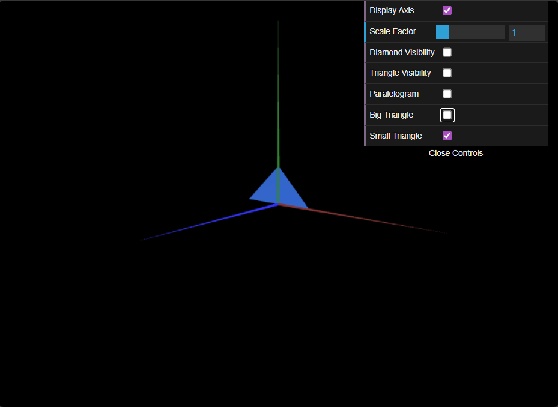

# CG 2025/2026

## Group T0xG0y

## TP 1 Notes

(add your main observations/remarks about your experiments here, in a bulleted list, and remove this line. Some examples below)

- In exercise 1 we observed that the order of the indexes affects which side will be visible, with counterclockwise giving visibility from the front and clockwise from the back.

.png)