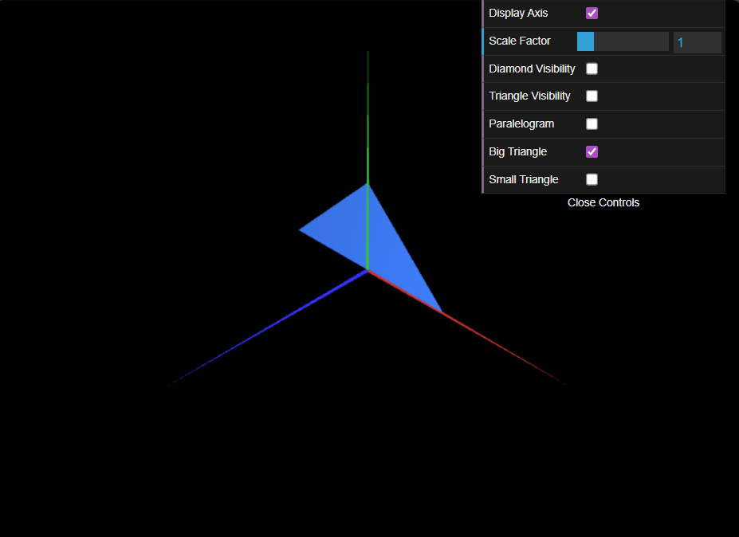

# CG 2025/2026

## Group T11G10

## TP 1 Notes

- In exercise 1 we observed that the order of the indexes affects which side will be visible, with counterclockwise giving visibility from the front and clockwise from the back.

