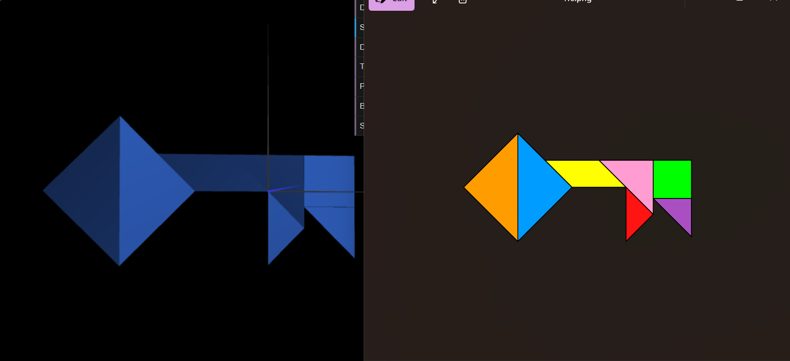
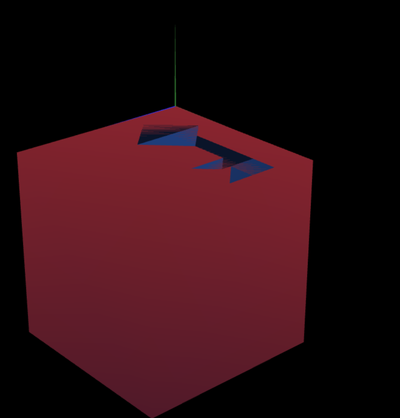

# CG 2025/2026

## Group T11G10

## TP 2 Notes

- Working around with the transformations was sometimes tricky, especially in transformations where the object would end up with non-vertices at the origin, namely the PI / 4 rotation of the diamond and the small triangle would lead to this. 
- It was tricky sometimes to know the order of the transformations we wanted to do.
- Figuring out how to make a composite object and that all transformations should be linked to the scene took a while.

- Figuring out how to put everything into place, essentially stacking transformations was a challenge, as initially it felt unpredictable;
- While probably out of context for this lab, getting the lighting to do what we want so that the image would show the tangram and the cube;
- Dealing with the vertices had its own challenge, as sometimes they wouldn't appear on the side they were supposed to, leaving the cube to be invisible from that side;

On the first screenshot the tangram has been moved 0.01 to avoid the clipping
.png)

