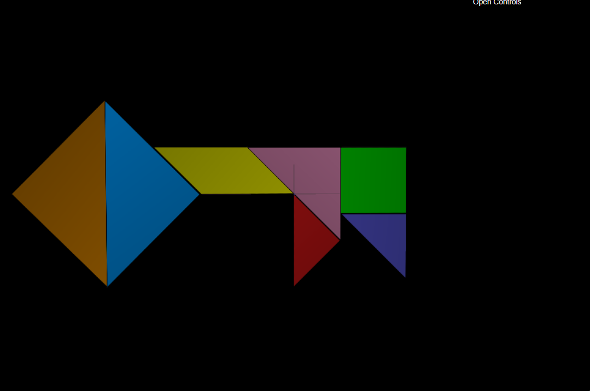
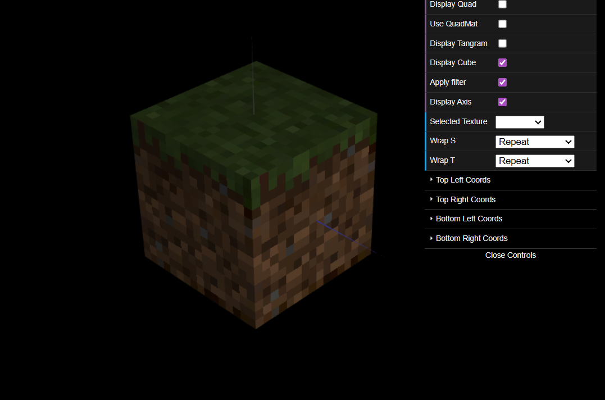

# CG 2025/2026

## Group T11G10

## TP 4 Notes

### Challenges

#### 4-1

- Tangram textures did not present too big of a problem,using the texture with lines to understand how the mapping actually worked was very useful to not make mistakes and follow the grid

##### 4-2

- Figuring out how to use the filter was hard, sometimes it would apply on all, sometimes only on one, some would update and some wouldn't, solution was to repeat a bit until an actual solution was found!
