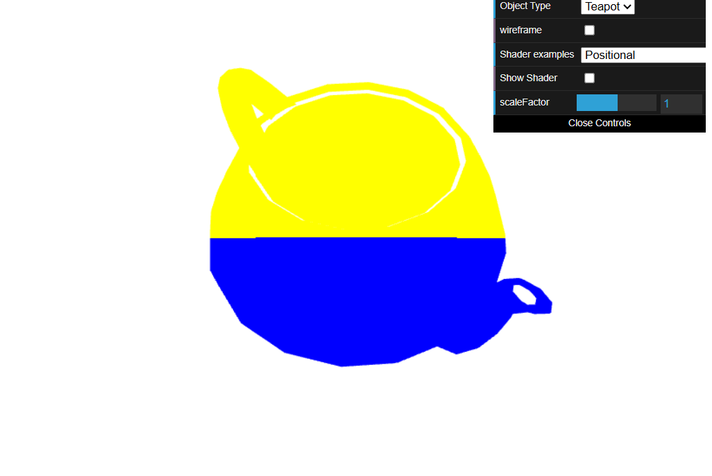
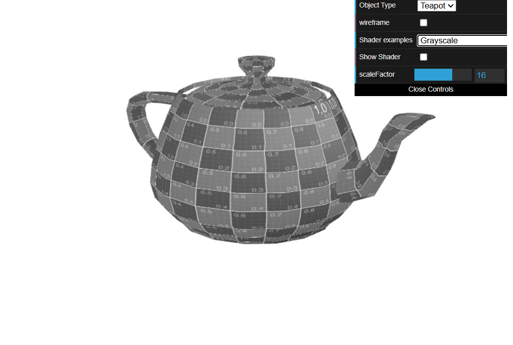
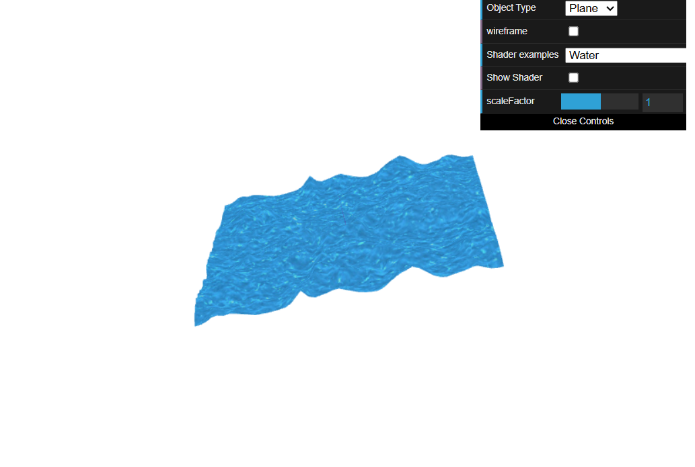

# CG 2025/2026

## Group T11G10

## TP 5 Notes

### Challenges

#### 5-1

It was confusing at first to work this shader, the new environment of the `.vert` and `.frag` and uncertainty on how anything worked. \
Understanding the problem itself was also hard at first.

#### 5-2

Given the example already present in sepia, making the shader was easy. Only problem that occurred was initially changing each of the RGB value to the value instead of the whole equation.

#### 5-3

Figuring out how to work the positions in `water.vert` was hard, following the example of the animation shaders helped. \
After having an implementation it was fun to try to smooth out the waters and adapt the shaders to create the best look.

